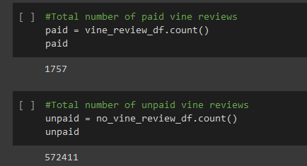

# Amazon_Vine_Analysis

## <u>Purpose of Amazon_Vine_Analysis:</u>
### We have been tasked by $ellby to take a closer look at Amazon's Vine program. $ellBy wants to know if it is worth the cost to invest into a program that gives out free products to reviewers. In order to get a better understanding of the program, we need to take a look at the percentage of Vine program vs Vine program reviews. Also, how many Vine program reviews received a 5-star rating? These questions should help $ellby make an informed decision on whether or not the program is worth the investment.
 

## <u>Results:</u>

 ## 1. How many Vine reviews and non-Vine reviews were there?
- ### In order to get a better understanding of how many Vine and non-Vine reviews there are, we first need to make sure that our data is useful. In order to be able to have accurate calculation we will on focus on reviews where the total votes count is equal or greater to 20. Additionally, we filter the newly created table for reviews where the number of helpful votes vs total votes is greater than 50%. Now, all that is left is to filer the Vine column for "Y" or "N" characters; "Y" standing for Vine reviews and "N" for non-Vine reviews. 
- ### As can be seen below, from the 574,168 total votes, **1,757** were paid Vine reviews, and **572,411** were unpaid Vine reviews.
 

 

 ## 2. How many Vine reviews were 5 stars? How many non-Vine reviews were 5 stars?

  

 - ### There are a total of <u>700</u> Vine reviews with a 5-star rating and <u>291,135</u> non-Vine reviews with a 5-star rating.
 

 ## 3.  What percentage of Vine reviews were 5 stars? What percentage of non-Vine reviews were 5 stars?

- ### The percentage of 5-star Vine reviews was 39.84% and 50.86% for non-Vine reviews.
 

## <u>Summary:</u>

- ### Taking a closer look at the data we can confirm that there is minimal to no-bias at all. 51% of the non-Vine reviews were 5 stars. This shows that more customers were willing to leave a positive review even if they did not get paid for it. As for Vine reviews, 40% had a rating of 5 stars. Also, the sample size of total 5-Star Vine reviews is much smaller than the one of total 5-star non-Vine reviews, 700 vs 291,135 respectively.

- ### In order to have a better understanding of the findings one should do an additional analysis of the data. In addition to looking at the percentages of 5-star Vine reviews vs non-5-star Vine reviews, one should take a look at the total number of 5-star reviews vs the number of Vine or non-Vine 5-star reviews. Doing so reveals that there are a total of 291,835 5-star reviews in the dataset. Only 0.24% of the total 5-star reviews were Vine reviews. This means that 99.76% of the total 5-star reviews were non-Vine reviews. This confirms that there is no bias when it comes to paid or unpaid 5-star Vine reviews in this dataset.

